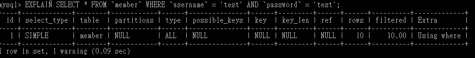
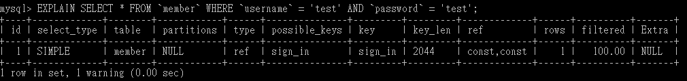

# 主題⼀：使⽤ Grid 完成排版

## 1. 說明 Grid 的基本設定觀念


## Container

- display : grid (垂直) / inline-grid (水平)
- grid-template-columns

  grid-template-rows

  ```
  Ex:
  grid-template-rows: 5px 40px auto 40px 5px;
  grid-template-columns: 40px 25% 2fr fr;
  ```

  

---

## Item

### 1. 用 line 設置範圍

```
grid-row: 1 / 3 ;

grid-column: 3 / 4 ;
```


### 2. 用 area 分配

```
Item 設置


.item1{ grid-area: header ; }

.item2{ grid-area: main ; }

.item3{ grid-area: footer ; }

.item4{ grid-area: sidebar ; }
```

```
Container 設置


grid-template-areas:
"header header header header"
"main main main sidebar"
"main main main sidebar"
"footer footer footer footer"
```


- 想要區塊空白?

```
none : 沒有指定區塊

 .   : 空格
```

```
Container 設置


grid-template-areas:
"header header header header"
"main main none sidebar"
"main main none sidebar"
"footer footer footer footer"
```


參考資料 : https://yukihiew.com/about-css-grid/

## 2. 利⽤ Grid 完成第⼀週作業，下⽅主內容 ( 景點列表 ) 的前端排版

> https://penny0330.github.io/WeHelp-assignments/week8/

---

# 主題二：完善資料驗證程序

# 主題三：AJAX 與 CORS

### 1. 什麼是 CORS？

> 透過 fetch 或 XMLHttpRequest 存取資料時，瀏覽器會因為 Origin 不同而無法得到回應，因此就需要遵守 CORS (Cross-Origin Resource Sharing)來取得。

### 2. 我們可以在⾃⼰的網⾴中，使⽤ fetch() 或是 XMLHttpRequest 連結到 https://www.google.com/ 並取得回應嗎？

> 不行，是跨來源請求，無法得到回應

### 3. 我們可以在⾃⼰的網⾴中，使⽤ fetch() 或是 XMLHttpRequest 連結到 https://padax.github.io/taipei-day-trip-resources/taipei-attractions-assignment.json 並取得回應嗎？和上述的狀況，差別在哪裡？

> 可以，因為是用瀏覽器瀏覽網站，跟用 AJAX 拿資料無關。

### 4. 如何開放我們⾃⼰開發的 API，讓別的網站透過 fetch() 或是 XMLHttpRequest 連結，達到如同第 3 點的可能性。

> 在後端設置 CORS header。
> <br/> 單一的 Origin : Access-Control-Allow-Origin : "Origin"
> <br/> 全部的 Origin : Access-Control-Allow-Origin : " \* "

參考資料 : https://blog.huli.tw/2021/02/19/cors-guide-1/

---

# 主題四：使⽤主鍵、索引優化資料庫查詢效率

### 1. 了解主鍵 (Primary Key) 和索引 (Index) 的觀念。

> ### 主鍵 (Primary Key)
>
> <br/> 1. 是一種 index
> <br/> 2. 不能為空值 Null
> <br/> 4. 設定主鍵的欄位值不可重複
> <br/> 3. 每個 table 只能有一個

> ### 索引 (Index)
>
> <br/> 1. 以資料欄位為依據，建立額外的資料結構，可以加快搜尋速度
> <br/> 2. 分為 4 種 :
> <br/> 主索引鍵( primary key )
> <br/> 唯一索引( unique index ) : 不可重複、可為 Null 值
> <br/> 非唯一索引( non-unique index ) : 可重複，可為 Null 值
> <br/> 全文檢索( full-text search) : 只能在「 CHAR 」、「 VARCHAR 」
> <br/> 與「 TEXT 」型態的欄位、可為 Null 值

### 2. 請在 member 資料表中加入適當的索引，加快以下 SQL 語句的查詢效率 :SELECT \* FROM member WHERE username=’test’ and password=’test’

```
ALTER TABLE `member` ADD INDEX `sign_in` (`username`, `password`)
```

### 3. 如何驗證查詢效率是否真的變更好了？

```
使用 EXPLAIN 指令來分析查詢效率
```

```
未加 Index 時 :
type: ALL，表示整個表格的資料都審查一遍；
rows: 10，表示查詢時檢查了 10 行。
```



```
加 Index 時 :
type: ref，一種索引搜尋；
rows: 1，表示查詢時只檢查了 1 行。
```



### 4. 為什麼索引的設置能有效地改善查詢效率？

> 索引會針對某一欄位去額外建立 B-Tree 樹狀結構
